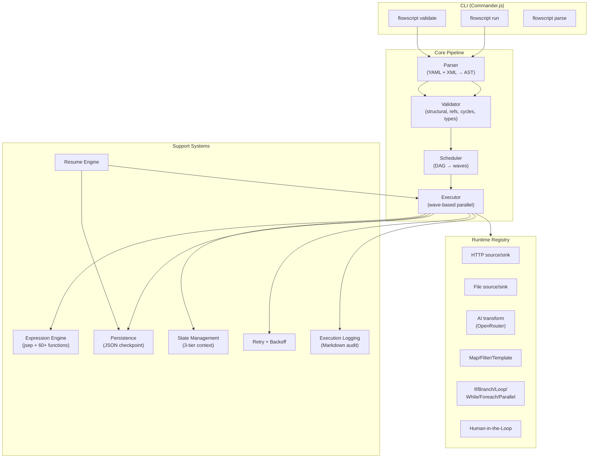
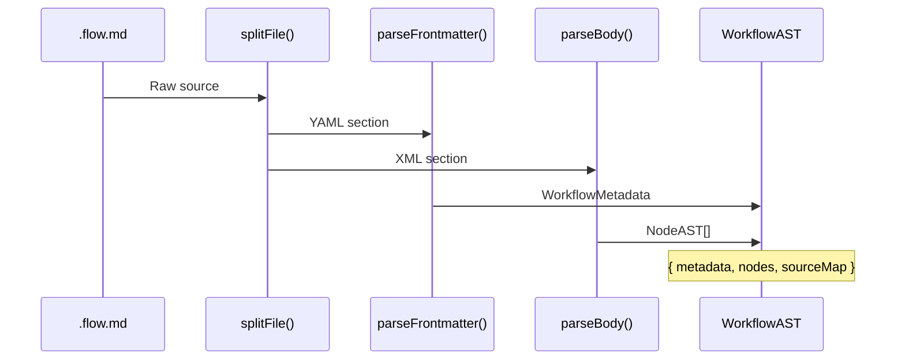
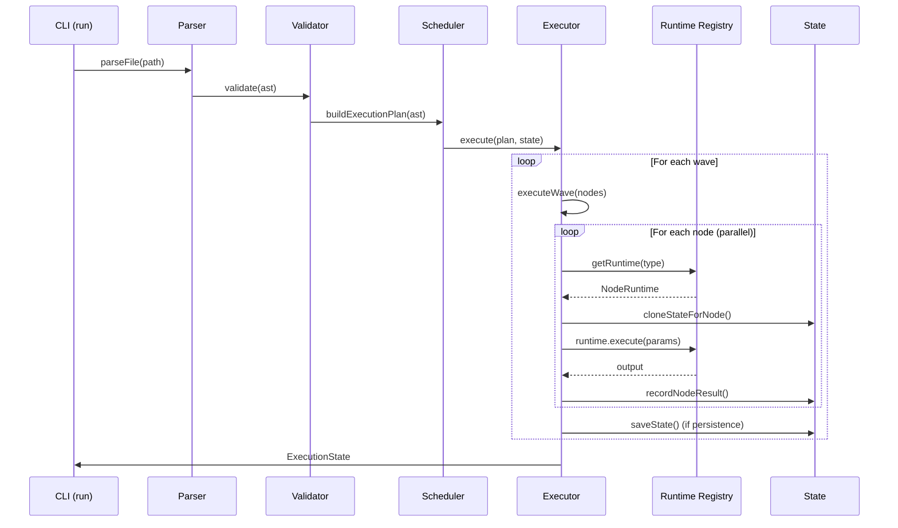
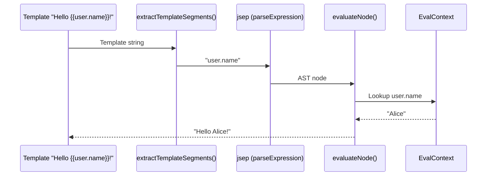

# Codebase Map

> Auto-generated by Cartographer. Last mapped: 2026-02-06T23:22:37Z

## System Overview

**FlowScript (maidit)** is a text-native workflow engine that executes `.flow.md` files — markdown documents containing YAML frontmatter + XML body. Positioned as "like n8n but markdown-based", it's a Git-native, version-controllable alternative to visual workflow tools.



## Directory Structure

```
maidit/
├── src/                          # Source code (~90k tokens)
│   ├── cli/                      # CLI commands (validate, run, parse)
│   │   ├── index.ts              # Commander.js entry point
│   │   ├── run.ts                # `flowscript run` implementation
│   │   ├── validate.ts           # `flowscript validate` implementation
│   │   ├── format.ts             # Error formatting (@babel/code-frame)
│   │   ├── run.test.ts           # CLI run tests
│   │   └── fixtures/             # Test workflow files
│   ├── parser/                   # .flow.md → AST parser
│   │   ├── index.ts              # Main parse() / parseFile() entry
│   │   ├── frontmatter.ts        # YAML frontmatter parser
│   │   ├── body.ts               # XML body parser (fast-xml-parser)
│   │   ├── location.ts           # Source location tracking
│   │   └── types.ts              # Internal parser types
│   ├── types/                    # Shared type definitions
│   │   ├── ast.ts                # Full AST types (WorkflowAST, NodeAST)
│   │   ├── errors.ts             # Error types (ValidationError, ParseResult)
│   │   └── index.ts              # Barrel re-exports
│   ├── validator/                # Multi-pass AST validation
│   │   ├── index.ts              # Orchestrator (structural → refs → cycles → types)
│   │   ├── structural.ts         # Required fields, valid types
│   │   ├── references.ts         # Node refs, secret refs, duplicate IDs
│   │   ├── cycles.ts             # Circular dependency detection (Kahn's)
│   │   └── types.ts              # Type compatibility (AI schemas)
│   ├── expression/               # Template & expression engine
│   │   ├── index.ts              # evaluateTemplate() entry point
│   │   ├── parser.ts             # {{}} extraction + jsep parsing
│   │   ├── evaluator.ts          # Sandboxed AST-walking evaluator
│   │   ├── context.ts            # Execution context builder
│   │   ├── types.ts              # Expression types
│   │   └── functions/            # 60+ built-in functions
│   │       ├── index.ts          # Function registry
│   │       ├── string.ts         # 14 string functions
│   │       ├── array.ts          # 24 array functions
│   │       ├── math.ts           # 15 math functions
│   │       ├── time.ts           # 16 time functions (Luxon)
│   │       ├── object.ts         # 13 object functions
│   │       └── type.ts           # 18 type check/conversion functions
│   ├── scheduler/                # DAG-based wave scheduler
│   │   ├── index.ts              # buildExecutionPlan() entry
│   │   ├── dag.ts                # Dependency graph builder
│   │   ├── waves.ts              # Wave computation (Kahn's algorithm)
│   │   ├── concurrency.ts        # Semaphore implementation
│   │   └── types.ts              # ExecutionWave, ExecutionPlan
│   ├── execution/                # Workflow executor
│   │   ├── index.ts              # Facade: execute, state, persistence, logging
│   │   ├── executor.ts           # Wave-based execution engine
│   │   ├── state.ts              # ExecutionState lifecycle
│   │   ├── persistence.ts        # Save/load state to JSON
│   │   ├── resume.ts             # Resume failed workflows
│   │   ├── retry.ts              # Retry with exponential backoff
│   │   ├── logging.ts            # Markdown execution logs
│   │   └── types.ts              # NodeResult, ExecutionState, RetryConfig
│   └── runtimes/                 # Node runtime implementations
│       ├── index.ts              # Auto-registers all runtimes
│       ├── registry.ts           # Singleton RuntimeRegistry
│       ├── types.ts              # NodeRuntime interface
│       ├── errors.ts             # HttpError, FileError, TimeoutError
│       ├── ai/                   # AI transform (OpenRouter API)
│       │   ├── runtime.ts        # LLM calls with tool-based structured output
│       │   ├── schema-dsl.ts     # TypeScript-like schema → Zod parser
│       │   ├── retry.ts          # AI-specific backoff + retry prompts
│       │   ├── errors.ts         # AIError, SchemaValidationError
│       │   └── types.ts          # AINodeConfig, AIResult, AIUsage
│       ├── http/                 # HTTP source/sink
│       │   ├── source.ts         # GET/POST with auth, JMESPath extraction
│       │   └── sink.ts           # POST/PUT/PATCH with auth
│       ├── file/                 # File source/sink
│       │   ├── source.ts         # Read files (JSON/text auto-detect)
│       │   ├── sink.ts           # Write files (auto mkdir, pretty JSON)
│       │   └── path.ts           # Path security & template resolution
│       ├── transform/            # Data transforms
│       │   ├── template.ts       # String templating
│       │   ├── map.ts            # Array item transformation
│       │   ├── filter.ts         # Array item filtering
│       │   └── types.ts          # Transform config types
│       ├── control/              # Control flow
│       │   ├── if.ts             # Conditional (then/else)
│       │   ├── branch.ts         # Pattern matching (cases)
│       │   ├── loop.ts           # Fixed iteration
│       │   ├── while.ts          # Condition-based loop
│       │   ├── foreach.ts        # Collection iteration
│       │   ├── parallel.ts       # Concurrent branches
│       │   ├── break.ts          # Loop break signal
│       │   ├── goto.ts           # Jump signal
│       │   ├── signals.ts        # BreakSignal, GotoSignal classes
│       │   └── types.ts          # Control flow config types
│       └── checkpoint/           # Human approval
│           ├── runtime.ts        # Interactive terminal prompts
│           └── types.ts          # CheckpointConfig, CheckpointResult
├── examples/                     # Example workflows
│   ├── hello-world.flow.md       # Fetch joke → format → save
│   ├── file-transform.flow.md    # Read JSON → filter → enrich → write
│   ├── hello-world.ast.json      # Parsed AST example
│   └── data/input.json           # Sample data (5 people with scores)
├── flowscript/                   # Design specifications
│   ├── WORKFLOW-ENGINE-SPEC.md   # Formal syntax specification
│   ├── WORKFLOW-ENGINE-BRAINSTORM.md  # Feature brainstorm document
│   └── WORKFLOW-ENGINE-PARADIGM-SHIFTS.md  # Future vision
├── .planning/                    # GSD planning system
│   ├── PROJECT.md                # Project definition
│   ├── STATE.md                  # Current planning state
│   ├── MILESTONES.md             # Milestone tracking
│   ├── milestones/               # v1.0 requirements, roadmap, audit
│   ├── phases/                   # 8 implementation phases
│   └── research/                 # Architecture, features, pitfalls research
├── flows.md                      # Complete pattern reference (35 workflows)
├── gaps.md                       # Gap analysis document
├── exploration-*.md              # Deep-dive analysis docs (5 files)
├── package.json                  # "flowscript" v0.1.0
├── tsconfig.json                 # ESNext, strict, bundler resolution
├── bunfig.toml                   # autoinstall = false
└── CLAUDE.md                     # AI assistant instructions
```

## Module Guide

### Parser (`src/parser/`)

**Purpose**: Parse `.flow.md` files (YAML frontmatter + XML body) into a typed AST
**Entry point**: `src/parser/index.ts`

| File | Purpose | Tokens |
|------|---------|--------|
| `index.ts` | Main `parse()` / `parseFile()` functions | 1,112 |
| `frontmatter.ts` | YAML parsing with Bun.YAML, semver validation | 2,139 |
| `body.ts` | XML parsing with fast-xml-parser, XXE prevention | 6,198 |
| `location.ts` | Binary search source location tracking | 918 |
| `types.ts` | Internal parser types | 298 |

**Exports**: `parse(source, filePath)`, `parseFile(filePath)`, `splitFile`, `parseFrontmatter`, `parseBody`, `createSourceMap`
**Dependencies**: `fast-xml-parser`, `Bun.YAML`

### Types (`src/types/`)

**Purpose**: Shared AST and error type definitions used throughout the codebase
**Entry point**: `src/types/index.ts`

| File | Purpose | Tokens |
|------|---------|--------|
| `ast.ts` | WorkflowAST, NodeAST (11 node types), WorkflowMetadata | 1,088 |
| `errors.ts` | ValidationError, ParseResult, ErrorCode, severity | 702 |
| `index.ts` | Barrel re-exports | 31 |

**Key types**: `WorkflowAST`, `NodeAST` (discriminated union of SourceNode, TransformNode, SinkNode, BranchNode, IfNode, LoopNode, WhileNode, ForeachNode, ParallelNode, CheckpointNode)

### Validator (`src/validator/`)

**Purpose**: Multi-pass AST validation with early termination
**Entry point**: `src/validator/index.ts`

| File | Purpose | Tokens |
|------|---------|--------|
| `index.ts` | Orchestrator: structural → refs → cycles → types | 823 |
| `structural.ts` | Required fields, valid node types, recursive | 2,995 |
| `references.ts` | Node refs, secret refs, duplicate IDs, Levenshtein hints | 2,146 |
| `cycles.ts` | Circular dependency detection (Kahn's + DFS) | 2,499 |
| `types.ts` | AI schema type compatibility validation | 1,813 |

**Exports**: `validate(ast)`, `validateWithOrder(ast)`, individual validators
**Pattern**: Sequential passes with early termination on errors

### Expression Engine (`src/expression/`)

**Purpose**: Sandboxed template evaluation (`{{expressions}}`) with 60+ built-in functions
**Entry point**: `src/expression/index.ts`

| File | Purpose | Tokens |
|------|---------|--------|
| `index.ts` | `evaluateTemplate()` main entry | 612 |
| `parser.ts` | `{{}}` extraction + jsep configuration | 776 |
| `evaluator.ts` | Sandboxed AST-walking evaluator | 1,869 |
| `context.ts` | Build EvalContext from ExecutionState | 659 |
| `types.ts` | Expression types | 756 |
| `functions/index.ts` | Function registry (60+ functions) | 962 |
| `functions/string.ts` | 14 string functions | 699 |
| `functions/array.ts` | 24 array functions | 977 |
| `functions/math.ts` | 15 math functions | 771 |
| `functions/time.ts` | 16 time functions (Luxon) | 1,231 |
| `functions/object.ts` | 13 object functions (dot-path access) | 1,051 |
| `functions/type.ts` | 18 type check/conversion functions | 939 |

**Exports**: `evaluateTemplate(template, context)`, `evaluate(expression, context)`, `getBuiltinFunctions()`
**Security**: Blocked `__proto__`/`constructor`/`prototype`, whitelisted functions only, no `eval`
**Dependencies**: `jsep`, `luxon`

### Scheduler (`src/scheduler/`)

**Purpose**: Build execution plans by topologically sorting nodes into parallel waves
**Entry point**: `src/scheduler/index.ts`

| File | Purpose | Tokens |
|------|---------|--------|
| `index.ts` | `buildExecutionPlan(ast)` main entry | 321 |
| `dag.ts` | Build dependency graph from `input` references | 234 |
| `waves.ts` | Compute waves via Kahn's algorithm | 431 |
| `concurrency.ts` | Semaphore for limiting concurrent operations | 415 |
| `types.ts` | ExecutionWave, ExecutionPlan, ExecutionOptions | 353 |

**Exports**: `buildExecutionPlan(ast)`, `Semaphore`
**Pattern**: DAG → topological sort → wave grouping → semaphore-limited execution

### Execution Engine (`src/execution/`)

**Purpose**: Wave-based workflow executor with state management, persistence, retry, and logging
**Entry point**: `src/execution/index.ts`

| File | Purpose | Tokens |
|------|---------|--------|
| `index.ts` | Facade: re-exports + `evaluateInContext`, `evaluateTemplateInContext` | 756 |
| `executor.ts` | Wave-based execution, control flow handling | 4,375 |
| `state.ts` | ExecutionState lifecycle, cloning for parallel safety | 863 |
| `persistence.ts` | Save/load state to JSON (Map ↔ Array serialization) | 1,089 |
| `resume.ts` | Resume failed workflows from wave checkpoints | 719 |
| `retry.ts` | `executeWithRetry()` with exponential backoff | 1,071 |
| `logging.ts` | Markdown execution log formatting & append | 1,283 |
| `types.ts` | NodeResult, ExecutionState, RetryConfig, PersistedState | 564 |

**Exports**: `execute(plan, state, options)`, `createExecutionState()`, `saveState()`, `loadState()`, `resumeWorkflow()`, `executeWithRetry()`
**Pattern**: Sequential waves → parallel nodes within wave → semaphore-limited concurrency

### Runtime System (`src/runtimes/`)

**Purpose**: Pluggable node implementations registered in a global singleton registry
**Entry point**: `src/runtimes/index.ts` (auto-registers all runtimes via side-effect imports)

| Subdirectory | Purpose | Key Files |
|-------------|---------|-----------|
| `ai/` | LLM transforms via OpenRouter with Zod schema validation | `runtime.ts`, `schema-dsl.ts` |
| `http/` | HTTP source (GET/POST + JMESPath) and sink (POST/PUT/PATCH) | `source.ts`, `sink.ts` |
| `file/` | File source/sink with path security and template resolution | `source.ts`, `sink.ts`, `path.ts` |
| `transform/` | Map, filter, template transforms | `map.ts`, `filter.ts`, `template.ts` |
| `control/` | If, branch, loop, while, foreach, parallel, break, goto | 10 files |
| `checkpoint/` | Human-in-the-loop terminal prompts | `runtime.ts` |

**Core interface**: `NodeRuntime<TConfig, TInput, TOutput>` with `execute(params)` method
**Pattern**: Auto-registration via side-effect imports, singleton registry, control flow runtimes return metadata (executor handles iteration/branching)

### CLI (`src/cli/`)

**Purpose**: Command-line interface with validate, run, and parse commands
**Entry point**: `src/cli/index.ts`

| File | Purpose | Tokens |
|------|---------|--------|
| `index.ts` | Commander.js setup, command definitions | 1,153 |
| `run.ts` | `flowscript run` with dry-run, config overrides, input | 3,166 |
| `validate.ts` | `flowscript validate` with strict mode, multi-file | 1,162 |
| `format.ts` | Compiler-style error formatting (@babel/code-frame) | 2,028 |

**Commands**: `validate <files...>`, `run <file>`, `parse <file>`
**Dependencies**: `commander`, `chalk`, `ora`, `@babel/code-frame`

## Data Flow

### Parse Pipeline


### Execution Pipeline


### Expression Evaluation


## Conventions

### File Format
- **YAML frontmatter**: Metadata, config, triggers, secrets
- **XML body**: `<workflow>` containing typed nodes with `id`, `type`, `input` attributes
- **Markdown footer**: Execution logs appended automatically

### Naming
- Node IDs: kebab-case (`fetch-data`, `format-joke`)
- Runtime types: `category:subtype` (`http:source`, `control:if`, `transform:map`)
- Error codes: `E` prefix with 4-digit number (`E1001`)
- Config fields: snake_case (`output_dir`, `max_retries`)

### Error Handling
- Result types: `{ success: true; data: T } | { success: false; errors: E[] }`
- All errors carry source location (line/column)
- Hints for actionable fixes ("Did you mean...?" via Levenshtein)
- Retryable error classification (429, 5xx, timeout)

### Security
- XXE prevention: `processEntities: false` in XML parser
- Prototype pollution prevention: blocked `__proto__`, `constructor`, `prototype`
- Path traversal prevention: blocked `../`, absolute paths
- Expression sandboxing: whitelisted functions only, no `eval`

### Testing
- Test files colocated: `*.test.ts` next to source
- Bun test runner (`bun test`)
- Integration tests in executor, unit tests elsewhere

## Gotchas

1. **Side-effect imports**: `src/runtimes/index.ts` uses `import './http/index.ts'` to register runtimes. Importing individual runtimes without the index won't register them.

2. **Control flow runtimes return metadata, not outputs**: If/Branch/Loop runtimes return result objects (`IfResult`, `LoopResult`). The executor interprets these and handles body execution.

3. **Break/Goto use exceptions**: `BreakSignal` and `GotoSignal` are thrown (not returned). The executor catches them to implement control flow jumps.

4. **State cloning for parallel nodes**: `nodeContext` is deep-cloned via `structuredClone`, but `nodeResults` Map is shared (safe because writes use unique nodeId keys).

5. **Persistence serializes Maps as arrays**: `nodeResults` Map is stored as `Array<[string, NodeResult]>` in JSON and restored on load.

6. **AI runtime uses OpenRouter, not direct provider APIs**: All LLM calls go through OpenRouter with tool-based structured output.

7. **Expression engine removes bitwise operators**: jsep is configured to remove `>>>`, `>>`, `<<`, `|`, `^`, `&` and add `??` (nullish coalescing).

8. **Path resolution happens at runtime**: Template paths like `{{config.output_dir}}/file.json` are resolved during execution, not parsing.

## Navigation Guide

**To add a new runtime**:
1. Create `src/runtimes/<type>/runtime.ts` implementing `NodeRuntime` interface
2. Create `src/runtimes/<type>/index.ts` with registry call: `runtimeRegistry.register('type:subtype', new MyRuntime())`
3. Add side-effect import in `src/runtimes/index.ts`
4. Add node parsing in `src/parser/body.ts` if new node type

**To add a new expression function**:
1. Add function to appropriate category in `src/expression/functions/<category>.ts`
2. Export from `src/expression/functions/index.ts`
3. Add tests in `src/expression/functions/functions.test.ts`

**To add a new CLI command**:
1. Add command definition in `src/cli/index.ts`
2. Create implementation in `src/cli/<command>.ts`
3. Add tests in `src/cli/<command>.test.ts`

**To add a new validation pass**:
1. Create validator in `src/validator/<name>.ts`
2. Add to pipeline in `src/validator/index.ts` (after appropriate existing pass)
3. Add error codes in `src/types/errors.ts`

**To add a new node type to the AST**:
1. Define type in `src/types/ast.ts`
2. Add to `NodeAST` union and `NodeType` union
3. Add parsing in `src/parser/body.ts`
4. Add structural validation in `src/validator/structural.ts`
5. Create runtime implementation

**To modify execution behavior**:
- Wave scheduling: `src/scheduler/waves.ts`
- Concurrency limits: `src/scheduler/concurrency.ts`
- Retry logic: `src/execution/retry.ts`
- State management: `src/execution/state.ts`
- Persistence format: `src/execution/persistence.ts`

## Tech Stack

| Technology | Purpose |
|-----------|---------|
| **Bun** | Runtime, bundler, test runner, native file/shell APIs |
| **TypeScript** | Type safety with strict mode |
| **fast-xml-parser** | XML → JSON parsing for workflow bodies |
| **jsep** | JavaScript expression parsing (custom operators) |
| **Luxon** | Date/time functions |
| **Zod** | Runtime schema validation (AI outputs) |
| **Commander.js** | CLI framework |
| **Chalk** | Terminal colors |
| **Ora** | CLI spinners |
| **@babel/code-frame** | Compiler-style error display |
| **@jmespath-community/jmespath** | JSON querying for HTTP responses |
